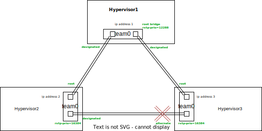

# Seapath Cluster Network

Seapath default recommended architecture is to use 3 hosts, directly interconnected to each other in a loop topology ("cluster network"). This network will be used for:
- ceph clustering communication (public and private network)
- corosync clustering communication (used by pacemaker)
- vxlan trafic to extend the VM bridges topology

It would also be possible to use external switches for this cluster network, but the high availability requirements would demand to use 2 switches (in case one fails), interconnected together (2 times in case one link fails), to connect every host to both switches and to use a mecanism like LACP to deal with multiple paths.

We think that for a 3-node cluster, a no-switch architecture is simple to create, manage, debug, etc.

We propose a layer 2 networking solution (using OpenVSwitch since it's included in the seapath distribution), where each host runs a software bridge (we call it "team0"), with 2 ports connected to external network interfaces. Each of the 2 network interfaces is connected to one of the other host. The ip address for the host on this cluster network is directly set to the team0 bridge: 

This will create an extended L2 network accross the 3 nodes, each node having a L3 ip address for all the mentionned communications, however this will create an obvious loop. L2 loops needs to be dealt with using some form of spanning tree protocol. We propose to use RSTP.
In this example we set a smaller rstp priority on the host1, which will make rstp cut the loop between the other 2 nodes by setting one port to "discarding" mode.

## Cabling

To simplify the cabling engineering, we recommend:
- thinking of the 3 hosts à "1, 2, 3", following each other in the loop "1 --> 2 --> 3 --> 1" 
  - if N=1 then N+1=2
  - if N=2 then N+1=3
  - if N=3 then N+1=1
- calling the 2 team0 bridge physical interfaces "team0_0" and "team0_1"
- on host N, team0_0 should be connected to team0_1 of host N+1
- consequently on host N, team0_1 is connected to team0_0 of host N-1

